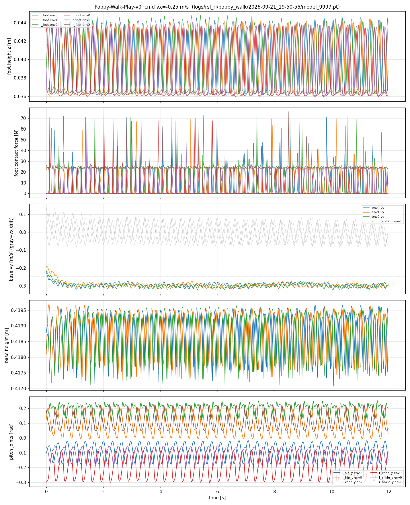

# Isaac Sim + Isaac Lab：Poppy 人形机器人强化学习行走

在 NVIDIA Isaac Sim / Isaac Lab 中，用 PPO 从零训练 Poppy 人形机器人（10 DOF 锁腿版）
完成 **稳定站立 → 0.25 m/s 指令前进行走 → 抗随机推力** 的完整闭环。
7 天冲刺项目，全部资产审计、奖励设计、失效分析与判卷工具链开源。



## 结果一览（v9，model_9997，v8 基础上微调 2500 轮，确定性策略，8 环境 × 12 s）

| 场景 | 存活率 | 双脚承重 | 前进速度 | 横向漂移 | 基座高 |
|---|---|---|---|---|---|
| 无扰动行走（指令 0.25 m/s） | 100% | 左 12.6 N / 右 12.9 N，交替反相 | 0.296 m/s | 0.001 m/s | 0.419 ± 0.0007 m |
| 随机推力（±0.3 m/s，每 4~6 s） | **100%** | 保持双脚交替承重，z 相关 −0.68 | 0.273 m/s | 0.005 m/s | 0.419 ± 0.0008 m |

步态：真·前进行走——双脚交替占空比 44%/43%（约各占一半在空中），
矢状面关节（髋/膝/踝俯仰）左右腿强反相摆动，横向漂移不到前进速度的 1%。

**行走视频**：[`docs/videos/poppy_walk_v9.mp4`](docs/videos/poppy_walk_v9.mp4)
（12 s / 720p / 相机侧面跟拍，`scripts/record_walk.py` headless 离屏渲染录制）。
脚尖朝向与位移方向一致（v7 横移、v8 倒走的对比视频保留在 `docs/videos/` 供对照）。

## 方法要点

- **资产工程**：URDF → USD 全流程审计（刚体/关节/限位/镜像轴/单位），修掉左膝镜像轴 bug；
  PD 增益全部实测标定（详见 `docs/D2-asset-report.md`、`docs/D3-standing-report.md`）。
- **站立 = 速度指令为 0 的速度跟踪任务**，与行走共用同一 MDP，一条训练管线通吃。
- **奖励迭代史（本项目最有价值的部分）**：v1 滑行 → v2 单腿跛 → v3 小碎步 → v4 奖励符号 bug →
  v5 右倾踩空 → v6 "可定价"惩罚（策略宁可交罚金也要白嫖速度奖励）→
  **v7 终止条件（不可定价）**：任一脚承重 EMA < 18% 体重即终止回合，从训练分布中物理删除跛行模式。
- **朝向三连坑（本项目最戏剧性的教训链）**：
  v1–v7 的"前进"指令一直发在基座 x 通道 → v7 学的是**横向移动**（判卷指标全部对朝向盲，肉眼看视频一帧抓到）；
  v8 按相机标定的"前方=+y"结论把指令换到 y 通道 → 结果学的是**倒走**
  （白色机器人渲染图正/背面肉眼难辨，标定结论判反了）；
  **v9 终裁改用 URDF 正运动学**：默认站姿下膝盖朝基座 **−y** 凸出（膝盖凸出方向=解剖学前方，
  且与仿真基座高度 0.419 m 交叉自洽），指令翻号到 −y 微调 2500 轮，得到真正前进行走。
  **教训：朝向判定不许用眼睛看渲染图，必须用运动学几何。**
- **判卷工具链**：`scripts/d5_eval.py`（存活率/速度/承重/步态/横向漂移全指标）、
  `scripts/probe_term.py`（终止项活体探查）、`scripts/probe_yaw.py`（朝向/蟹行角探查）。
  期间发现并修复判卷脚本自身的两处缺陷：接触力索引 bug（机器人本体 body 顺序 ≠
  传感器 body 顺序，D5 报告 §4）与指令通道写死 bug（pin_command 钉在旧坐标系假设上，
  策略收到分布外指令后被误判为"慢速蹭步"）。

## 文档

| 文件 | 内容 |
|---|---|
| `docs/URDF-audit-report.md` | 资产审计（单位/限位/镜像） |
| `docs/D2-asset-report.md` | USD 资产构建与标定 |
| `docs/D3-standing-report.md` | 站立任务（里程碑 1，含镜像轴 bug 排查） |
| `docs/D5-walk-report.md` | 行走任务（里程碑 2，v1–v9 完整失效模式史 + 两次朝向更正） |
| `docs/local-setup.md` | 环境复现手册 |

## 快速复现

```bash
# 训练（2048 并行环境，RTX 3090 约 40 min / 2500 轮）
bash scripts/run.sh scripts/train_poppy.py --headless --task Poppy-Walk-v0 \
  --num_envs 2048 --max_iterations 2500

# 判卷（--vx 语义 = 前进速度，写入基座 -y 通道）
bash scripts/run.sh scripts/d5_eval.py --headless \
  --task Poppy-Walk-Play-v0 --checkpoint <ckpt> --vx -0.25 --duration 12

# 录制侧面跟拍视频
bash scripts/run.sh scripts/record_walk.py --headless --enable_cameras \
  --checkpoint <ckpt> --seconds 12 --out out/videos
```

## 边界声明

- 所有结论基于 **Isaac Sim 仿真**，未上真机（无 sim2real 声明）。
- 步态为小步高频（抬脚 ~1 cm），非自然大步态；前进速度存在 ~18% 超调，留作后续改进。
- v1–v7 时代报告的"行走"实为横向移动、v8 的"前进"实为倒走（v9 已用运动学终裁更正，
  完整经过见 D5 报告 §8–§9）——历史判卷数据本身真实有效，只是描述的对象不是前向步态。
- 训练期间云宿主机曾 PCIe 降级导致训练变慢，已按"诊断 → 洗清代码 → 定位宿主机"流程记录；
  后续带宽自行恢复（见 D5 报告）。

---

## 简历段落（可直接引用）

> **基于 Isaac Sim/Isaac Lab 的人形机器人强化学习行走**（个人项目，2026.09）
> 在 Isaac Sim 中为 Poppy 人形机器人（10 DOF）构建完整 RL 训练管线，PPO 训练实现 0.25 m/s
> 指令双足前进行走（跟踪超调 ~18%，横向漂移 <1%），随机推力（±0.3 m/s）下 100% 存活。
> 独立完成 URDF→USD 资产审计（修复左膝镜像轴缺陷）、PD 增益实测标定与 9 轮奖励工程迭代；
> 针对策略"跛行作弊"，将承重对称约束从奖励惩罚升级为回合终止条件（消除可定价性）；
> 两次定位判卷系统的"朝向盲区"（横向移动误判为前进、倒走误判为前进），
> 最终用 URDF 正运动学（膝盖凸出方向）替代肉眼标定终裁坐标系，重训获得真正前进步态；
> 建立判卷工具链并排查出测量脚本自身的刚体索引与指令通道两处缺陷，
> 形成"失效模式→探针定位→修复→复测"的完整调试方法论。
> 代码与全部技术报告开源：github.com/GaoPeixin418/isaacsim-poppy-walk
