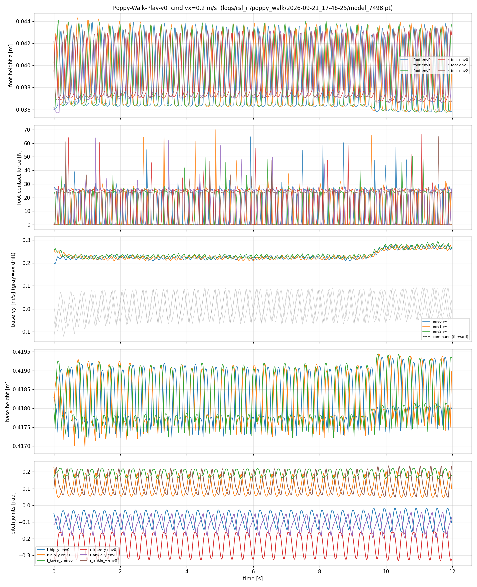

# Isaac Sim + Isaac Lab：Poppy 人形机器人强化学习行走

在 NVIDIA Isaac Sim / Isaac Lab 中，用 PPO 从零训练 Poppy 人形机器人（10 DOF 锁腿版）
完成 **稳定站立 → 0.2 m/s 指令前进行走 → 抗随机推力** 的完整闭环。
7 天冲刺项目，全部资产审计、奖励设计、失效分析与判卷工具链开源。



## 结果一览（v8，model_7498，确定性策略，8 环境 × 12 s）

| 场景 | 存活率 | 双脚承重 | 前进速度 | 横向漂移 | 基座高 |
|---|---|---|---|---|---|
| 无扰动行走（指令 0.2 m/s） | 100% | 左 12.2 N / 右 14.0 N，z 相关 −0.68 反相交替 | 0.234 m/s | 0.013 m/s | 0.418 ± 0.0007 m |
| 随机推力（±0.3 m/s，每 4~6 s） | **100%** | 保持双脚交替承重 | 0.212 m/s | 0.011 m/s | 0.418 ± 0.0008 m |

步态：真·前进行走——双脚交替占空比 49%/40%（约各占一半在空中），
矢状面关节（髋/膝/踝俯仰）左右腿强反相摆动，横向漂移仅 ~5% 前进速度。

**行走视频**：[`docs/videos/poppy_walk_v8.mp4`](docs/videos/poppy_walk_v8.mp4)
（12 s / 720p / 相机正侧面跟拍，`scripts/record_walk.py` headless 离屏渲染录制）。

## 方法要点

- **资产工程**：URDF → USD 全流程审计（刚体/关节/限位/镜像轴/单位），修掉左膝镜像轴 bug；
  PD 增益全部实测标定（详见 `docs/D2-asset-report.md`、`docs/D3-standing-report.md`）。
- **站立 = 速度指令为 0 的速度跟踪任务**，与行走共用同一 MDP，一条训练管线通吃。
- **奖励迭代史（本项目最有价值的部分）**：v1 滑行 → v2 单腿跛 → v3 小碎步 → v4 奖励符号 bug →
  v5 右倾踩空 → v6 "可定价"惩罚（策略宁可交罚金也要白嫖速度奖励）→
  **v7 终止条件（不可定价）**：任一脚承重 EMA < 18% 体重即终止回合，从训练分布中物理删除跛行模式。
- **坐标系更正（v8，本项目最戏剧性的一课）**：v1–v7 的"前进"指令一直发在基座 x 通道，
  而相机标定实验（`scripts/cam_calib.py`：同一姿态从前后左右各渲一帧）证明
  **解剖学正前方 = 基座 +y** —— 也就是说 v7 学的其实是"向右横移"（蟹行角 −0.6°，
  判卷全指标对朝向盲，肉眼看视频一帧抓到）。v8 把前进指令换到 y 通道后重训，
  策略在 7500 轮内收敛出真正的前进步态。
- **判卷工具链**：`scripts/d5_eval.py`（存活率/速度/承重/步态/横向漂移全指标）、
  `scripts/probe_term.py`（终止项活体探查）、`scripts/probe_yaw.py`（朝向/蟹行角探查）。
  期间发现并修复判卷脚本自身的两处缺陷：接触力索引 bug（机器人本体 body 顺序 ≠
  传感器 body 顺序，D5 报告 §4）与指令通道写死 bug（pin_command 钉在旧坐标系假设上，
  策略收到分布外指令后被误判为"慢速蹭步"）。

## 文档

| 文件 | 内容 |
|---|---|
| `docs/URDF-audit-report.md` | 资产审计（单位/限位/镜像） |
| `docs/D2-asset-report.md` | USD 资产构建与标定 |
| `docs/D3-standing-report.md` | 站立任务（里程碑 1，含镜像轴 bug 排查） |
| `docs/D5-walk-report.md` | 行走任务（里程碑 2，v1–v8 完整失效模式史 + 坐标系更正） |
| `docs/local-setup.md` | 环境复现手册 |

## 快速复现

```bash
# 训练（2048 并行环境，RTX 3090 约 40 min / 2500 轮）
bash scripts/run.sh scripts/train_poppy.py --headless --task Poppy-Walk-v0 \
  --num_envs 2048 --max_iterations 2500

# 判卷（--vx 语义 = 前进速度，写入基座 +y 通道）
bash scripts/run.sh scripts/d5_eval.py --headless \
  --task Poppy-Walk-Play-v0 --checkpoint <ckpt> --vx 0.2 --duration 12

# 录制正侧面跟拍视频
bash scripts/run.sh scripts/record_walk.py --headless --enable_cameras \
  --checkpoint <ckpt> --seconds 12 --out out/videos
```

## 边界声明

- 所有结论基于 **Isaac Sim 仿真**，未上真机（无 sim2real 声明）。
- 步态为小步高频（抬脚 ~1 cm），非自然大步态；前进速度存在 ~17% 超调，留作后续改进。
- v1–v7 时代报告的"行走"实为横向移动（基座坐标系与解剖学朝向差 90°，v8 已更正，
  完整经过见 D5 报告 §8）——历史判卷数据本身真实有效，只是描述的对象是横向步态。
- 训练期间云宿主机曾 PCIe 降级导致训练变慢，已按"诊断 → 洗清代码 → 定位宿主机"流程记录；
  后续带宽自行恢复（见 D5 报告）。

---

## 简历段落（可直接引用）

> **基于 Isaac Sim/Isaac Lab 的人形机器人强化学习行走**（个人项目，2026.09）
> 在 Isaac Sim 中为 Poppy 人形机器人（10 DOF）构建完整 RL 训练管线，PPO 训练实现 0.2 m/s
> 指令双足前进行走（跟踪误差 <17%，横向漂移 <6%），随机推力（±0.3 m/s）下 100% 存活。
> 独立完成 URDF→USD 资产审计（修复左膝镜像轴缺陷）、PD 增益实测标定与 8 轮奖励工程迭代；
> 针对策略"跛行作弊"，将承重对称约束从奖励惩罚升级为回合终止条件（消除可定价性）；
> 通过相机标定实验发现并修正基座坐标系与解剖学朝向 90° 偏差导致的"横向移动"隐性缺陷，
> 重训获得真正的前进步态；建立判卷工具链并排查出测量脚本自身的刚体索引与指令通道两处缺陷，
> 形成"失效模式→探针定位→修复→复测"的完整调试方法论。
> 代码与全部技术报告开源：github.com/GaoPeixin418/isaacsim-poppy-walk
