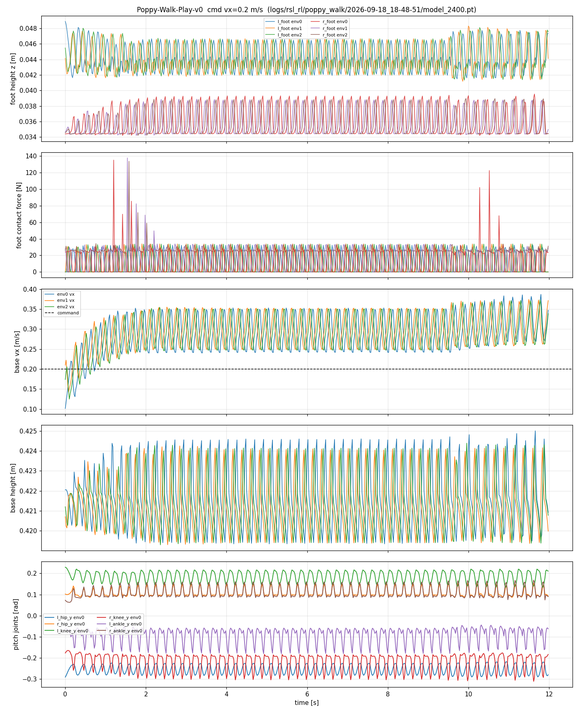

# Isaac Sim + Isaac Lab：Poppy 人形机器人强化学习行走

在 NVIDIA Isaac Sim / Isaac Lab 中，用 PPO 从零训练 Poppy 人形机器人（10 DOF 锁腿版）
完成 **稳定站立 → 0.2 m/s 指令行走 → 抗随机推力** 的完整闭环。
7 天冲刺项目，全部资产审计、奖励设计、失效分析与判卷工具链开源。



## 结果一览（v7，model_2400，确定性策略，8 环境 × 12 s）

| 场景 | 存活率 | 双脚承重 | 净速度 | 基座高 |
|---|---|---|---|---|
| 无扰动行走（指令 0.2 m/s） | 100% | 左 10.6 N / 右 14.5 N，z 相关 −0.49 反相交替 | 0.289 m/s | 0.421 ± 0.0015 m |
| 随机推力（±0.3 m/s，每 4~6 s） | **100%** | 保持双脚交替承重 | 0.245 m/s | 0.421 ± 0.0013 m |

步态：~3 Hz 小步快走式动态步态（步长 ~9.6 cm，抬脚 6~10 mm）。

## 方法要点

- **资产工程**：URDF → USD 全流程审计（刚体/关节/限位/镜像轴/单位），修掉左膝镜像轴 bug；
  PD 增益全部实测标定（详见 `docs/D2-asset-report.md`、`docs/D3-standing-report.md`）。
- **站立 = 速度指令为 0 的速度跟踪任务**，与行走共用同一 MDP，一条训练管线通吃。
- **奖励迭代史（本项目最有价值的部分）**：v1 滑行 → v2 单腿跛 → v3 小碎步 → v4 奖励符号 bug →
  v5 右倾踩空 → v6 "可定价"惩罚（策略宁可交罚金也要白嫖速度奖励）→
  **v7 终止条件（不可定价）**：任一脚承重 EMA < 18% 体重即终止回合，从训练分布中物理删除跛行模式。
- **判卷工具链**：`scripts/d5_eval.py`（存活率/速度/承重/步态全指标）、
  `scripts/probe_term.py`（终止项活体探查）。
  期间发现并修复判卷脚本自身的接触力索引 bug（机器人本体 body 顺序 ≠ 传感器 body 顺序），
  详见 `docs/D5-walk-report.md` §4。

## 文档

| 文件 | 内容 |
|---|---|
| `docs/URDF-audit-report.md` | 资产审计（单位/限位/镜像） |
| `docs/D2-asset-report.md` | USD 资产构建与标定 |
| `docs/D3-standing-report.md` | 站立任务（里程碑 1，含镜像轴 bug 排查） |
| `docs/D5-walk-report.md` | 行走任务（里程碑 2，v1–v7 完整失效模式史） |
| `docs/local-setup.md` | 环境复现手册 |

## 快速复现

```bash
# 训练（2048 并行环境，RTX 3090 约 2 h）
bash scripts/run.sh scripts/train_poppy.py --headless --task Poppy-Walk-v0

# 判卷
bash scripts/run.sh scripts/d5_eval.py --headless \
  --task Poppy-Walk-Play-v0 --checkpoint <ckpt> --vx 0.2 --duration 12
```

## 边界声明

- 所有结论基于 **Isaac Sim 仿真**，未上真机（无 sim2real 声明）。
- 步态为小步快走式，非自然大步态；速度跟踪存在 ~45% 超调，留作后续改进。
- 训练期间云宿主机 PCIe 降级导致训练变慢，已按"诊断 → 洗清代码 → 定位宿主机"流程记录（见 D5 报告）。

---

## 简历段落（可直接引用）

> **基于 Isaac Sim/Isaac Lab 的人形机器人强化学习行走**（个人项目，2026.09）
> 在 Isaac Sim 中为 Poppy 人形机器人（10 DOF）构建完整 RL 训练管线，PPO 训练实现 0.2 m/s
> 指令双足行走，随机推力（±0.3 m/s）下 100% 存活。独立完成 URDF→USD 资产审计（修复左膝
> 镜像轴缺陷）、PD 增益实测标定与 7 轮奖励工程迭代；针对策略"跛行作弊"，将承重对称约束从
> 奖励惩罚升级为回合终止条件（消除可定价性），收敛出双足交替步态；建立判卷工具链并排查出
> 测量脚本自身的刚体索引缺陷，形成"失效模式→探针定位→修复→复测"的完整调试方法论。
> 代码与全部技术报告开源：github.com/GaoPeixin418/isaacsim-poppy-walk
